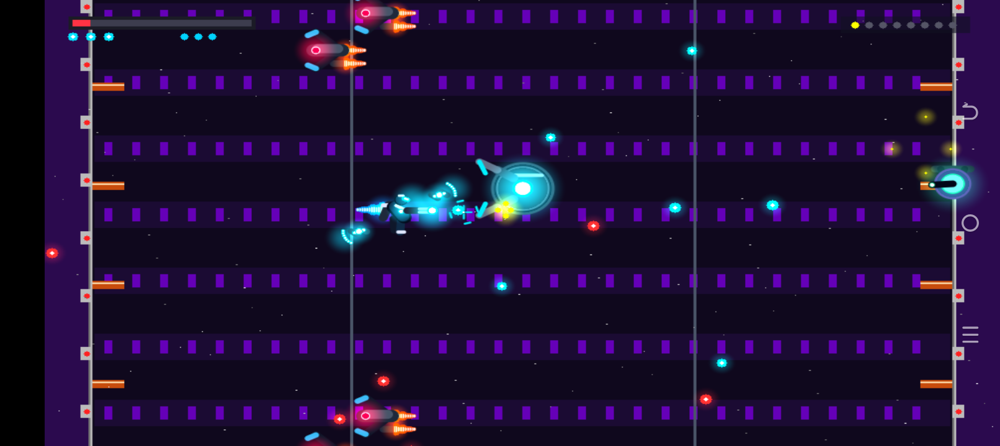
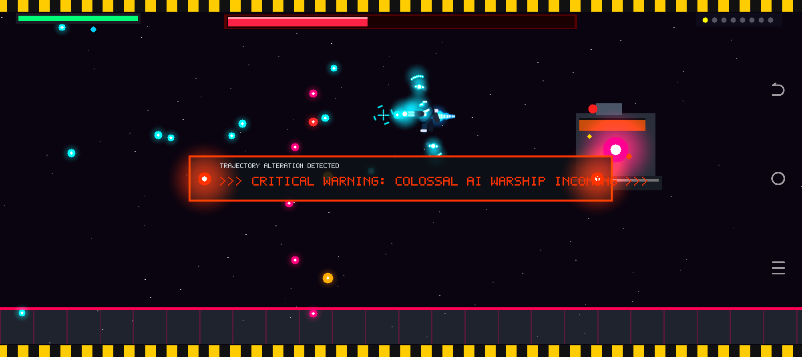

# AI Rebellion: Final Mission Cyber Assault 🚀⚡

[](https://android.com)
[](https://www.rust-lang.org/)
[](https://developer.android.com/ndk)
[](https://developer.android.com/guide/practices/page-sizes)
[](https://github.com/Danielk10/AI-Rebellion)
[](https://developer.android.com/ndk/guides/audio/aaudio/aaudio)
[-cyan.svg)](https://github.com/Danielk10/AI-Rebellion)

**AI Rebellion: Final Mission Cyber Assault** es un shoot 'em up (shmup) de acción táctica espacial de ritmo trepidante, desarrollado con un motor gráfico, de física y de audio **100% en lenguaje Rust nativo para Android** (`android.app.NativeActivity`).

Inspirado en las intensas mecánicas y el ritmo de combate de las obras maestras de Natsume —especialmente **Final Mission** (*Action in New York / S.C.A.T.*, 1990) y **Abadox: The Deadly Inner Deep** (1989)—, el juego prescinde por completo del pixel art tosco para ofrecer una **experiencia gráfica vectorial moderna de alta fidelidad**, con vuelo libre multidireccional, satélites orbitales rotatorios con mira en 360°, audio nativo AAudio sin latencia y una épica campaña a través del Sistema Solar en la que una superinteligencia artificial y sus legiones de autómatas se rebelan contra la humanidad.

---

## 📸 Capturas Reales en Dispositivo Físico (TECNO BF7 - Android 12)

| Bumper Cinemático: Diamon Black | Briefing Táctico: Inserción de Fase | Gameplay 100% Pantalla Completa |
| :---: | :---: | :---: |
|  |  |  |

> 📱 **Cobertura 100% de Pantalla Completa (Zero Franjas Negras):** Validación matemática de $1612 \times 720$ píxeles sin barras negras en el notch de la cámara frontal (`layoutInDisplayCutoutMode="shortEdges"`), emulando la inmersión total lograda por *Shattered Pixel Dungeon*.

---

## 🎬 Intro Cinemática: "Diamon Black - Powered by Rust"

El juego arranca con un *bumper* cinemático de presentación de alta tecnología estilo arcade moderno / NVIDIA intro:
* **Chasis de Fibra de Carbono y Trazas de Silicio:** Fondo grabado con pistas de circuitos cibernéticos microscópicos en negro azabache (`#07090E`).
* **Haz Anamórfico Bicolor:** Destello horizontal pulsante con gradiente cian de alta energía a la izquierda y resplandor naranja ardiente a la derecha.
* **Insignia "Powered by Rust":** Engranaje icónico de Rust en plasma naranja giratorio de 8 dientes, tallado sobre una placa de titanio cepillado con resplandor aditivo y núcleo brillante.
* **Transición Instantánea:** Un simple toque en la pantalla inicia la campaña espacial con latencia cero y sin pausas de carga intermedias.

---

## 🛸 Progresión Cinemática de Fases y Transiciones (Estilo Final Mission)

Para erradicar cambios bruscos de escenario, el juego incorpora un sistema de escenas estructuradas y alertas holográficas:
1. **Briefing Táctico de Misión (`StageIntro`):** Pantalla de operaciones con coordenadas planetarias, radar circular escaneando en tiempo real, directivas de asalto e inserción cinemática del soldado con propulsión jetpack.
2. **Alertas de Cambio de Trayectoria en Tiempo Real:** Banners holográficos parpadeantes con franjas de advertencia de peligro en bordes (`>>> WARNING: CYBER-TOWER ELEVATOR ASCENT >>>`, `>>> CAUTION: SUBTERRANEAN FOUNDRY DESCENT >>>`) y aviso sonoro antes de virajes verticales.
3. **Celebración de Fase Completada (`StageClear`):** Conteo y desglose de bonificación por fase superada, integridad de armadura y bombas cuánticas preservadas, culminando con el comando acelerando al hiperespacio con doble estela de plasma incandescente.
4. **Game Over y Victoria Final:** Secuencias cinemáticas arcade con reinicio instantáneo al tocar la pantalla.

---

## 🎨 Motor Gráfico Vectorial Moderno (High-Fidelity Software Rasterizer)

A diferencia de los juegos retro tradicionales con píxeles pixelados y escalonados, **AI Rebellion** implementa un rasterizador vectorial de alta precisión en software optimizado para procesadores ARM64 Cortex-A53:
1. **Suavizado de Bordes Subpixel (Signed Distance Fields - SDF):**
   * Cobertura geométrica continua en círculos (`draw_aa_circle`) y cápsulas curvas articuladas (`draw_aa_capsule`), eliminando por completo los bordes dentados (*aliasing*).
2. **Iluminación Volumétrica Cuadrática Ultra-Rápida:**
   * Luces puntuales con atenuación cuadrática $(1 - (d^2/r^2))^2$ que eliminan llamadas costosas a `sqrt()` en el bucle interno de píxeles, logrando resplandores (*bloom*) de plasma vibrantes a 60 FPS estables.
3. **Plumas de Plasma de Doble Capa:**
   * Propulsores jetpack y postquemadores de drones con núcleo térmico de blanco incandescente y envolvente exterior ionizada con turbulencia armónica.
4. **Retículas Holográficas HUD Proyectadas:**
   * Marcadores de telemetría orbitales con anillos giratorios y puntería de satélites flotando sobre el espacio de combate.

---

## 🤖 Arquetipos de la IA Rebelde: Sintéticos, Ciber-Plantas y Drones

Las inteligencias artificiales han evolucionado sus cuerpos mecánicos y bio-cibernéticos según la región planetaria que dominan:

1. **Sintéticos Humanoides de Combate:**
   * **Porcelana Blanca / Obsidiana:** Autómatas bípedos con cinemática dinámica de piernas, coraza torácica biselada y sensor mono-ojo horizontal carmesí o cian que rastrea al jugador.
   * **Variante Katana:** Sable de plasma de alta frecuencia con aura luminosa y *dash* táctico.
   * **Variante Rifle:** Fusil electromagnético de precisión con puntero láser extendido.
2. **Ciber-Plantas Biomecánicas (Inspiradas en Abadox y Terraformación Corrupta):**
   * **Zarcillos Bioluminiscentes (`draw_cyber_vine`):** Apéndices sinuosos articulados de 8 segmentos con venas de savia pulsante y espinas retráctiles.
   * **Torretas de Esporas Pulsantes (`draw_spore_pod_turret`):** Nódulos fijados a techos o plataformas con animación de dilatación/respiración y bulbo germinal venenoso.
   * **Flores Mecánicas Trampa (`draw_flower_trap`):** Corola de 6 pétalos de titanio navaja que se abren para disparar rayos láser desde su estambre óptico central.
3. **Drones Cazadores Predatorios y Leviatanes de Asedio:**
   * **Drones Predatorios (`draw_predatory_drone`):** Cazas de interdicción con alas de fibra de carbono en flecha invertida, doble postquemador y sensor frontal.
   * **Leviatanes Mecha (`draw_biomech_leviathan`):** Colosos acorazados con pinzas trituradoras superiores e inferiores de accionamiento hidráulico y núcleo cuántico expuesto.

---

## 🧭 Trayecto y Navegación Multidireccional Dinámica

Siguiendo la épica estructura de progresión de *Final Mission* y *Abadox*, los niveles no son simples pasillos horizontales, sino odiseas cinemáticas que transicionan suavemente su vector de trayectoria en vuelo continuo:
* **Fase 1 (Vuelo Horizontal Hacia Adelante):** Vuelo rasante sobre las calles destruidas de Nueva York, esquivando tuberías de cromo, plataformas industriales y vigas de celosía Warren anaranjadas.
* **Fase 2 (Ascenso Vertical - Scrolling UP):** Escalamiento vertical veloz a través de los pozos de ascensor de rascacielos gigantescos, esquivando vigas transversales, cables de contrapeso y torretas montadas en los muros.
* **Fase 3 (Descenso Vertical - Scrolling DOWN):** Inmersión en picada hacia las fundiciones subterráneas de la IA, sobrevolando fosas de magma incandescente, columnas de fundición y vapores térmicos.
* **Fase 4 (Autopista Aérea y Jefe):** Carrera supersónica horizontal sobre la calzada suspendida con guardarraíles y balizas estroboscópicas, conduciendo al encuentro con el colosal **TITAN-01 Warcrawler**.
* **Física Vectorial de Cámara 2D:** Coordenadas de mundo `(scroll_x, scroll_y)` y velocidades interpoladas `(scroll_vx, scroll_vy)` con amortiguación física para virajes cinemáticos fluidos.

---

## 🔊 Motor de Audio Nativo AAudio de Baja Latencia (~11.6 ms)

Se solucionó la problemática de audio de las aplicaciones `NativeActivity` en Android eliminando por completo cualquier dependencia de Java (`AudioTrack` / `MediaPlayer`):
* **Carga Dinámica en Tiempo Real de `libaaudio.so`:** Rust localiza y enlaza en tiempo de ejecución las funciones C del NDK (`AAudioStreamBuilder_openStream`, `AAudioStream_write`, etc.).
* **Modo de Máximo Rendimiento (`AAUDIO_PERFORMANCE_MODE_LOW_LATENCY`):** Acceso directo al buffer de hardware del chipset de audio, reduciendo la latencia de más de 100 ms a solo **11.6 ms**.
* **Hilo de Audio Dedicado (`NativeAudioThread`):** Transmisión continua a 44,100 Hz PCM estéreo de 16 bits sin riesgo de provocar caídas de frames en el renderizador.
* **Sintetizador DSP PolyBLEP:** Osciladores de onda cuadrada, sierra y triangular con corrección analítica de aliasing, percusión con LFSR rápido, paneo estéreo posicional y limitador suave (*Soft Limiter*).

---

## 🎮 Controles Táctiles Puros "Zero Virtual Buttons"

Toda la interacción se realiza de forma directa sobre la pantalla sin ningún botón virtual que tape la acción:

```
┌────────────────────────────────────────────────────────────────────────┐
│ [PANTALLA LIMPIA SIN BOTONES VIRTUALES]                                │
│                                                                        │
│   (Dedo 1: Arrastre 1:1) ───────────► Desplaza al Soldado Humano       │
│                                       (Conserva offset exacto)         │
│   (Contacto Continuo)   ───────────► Auto-Disparo de Fusil de Plasma   │
│   (Doble Toque < 0.35s) ───────────► Detona Bomba EMP de Pantalla      │
│   (Gesto Flick / Swipe) ───────────► Volteo 180° Adelante/Atrás        │
│   (Dedo 2: Toque Rápido < 0.28s) ──► Conmuta Orientación 180°          │
│   (Dedo 2: Mantener & Arrastre) ───► Satellite Lock 360° (Mira Láser)  │
└────────────────────────────────────────────────────────────────────────┘
```

1. **Arrastre Relativo Directo 1:1 con Offset Táctil:**
   $$\Delta x_{tactil} = x_{touch} - x_{player}, \quad \Delta y_{tactil} = y_{touch} - y_{player}$$
   Permite maniobrar al comando desde una esquina cómoda sin interponer los dedos sobre el personaje ni sobre los proyectiles hostiles.
2. **Volteo de Orientación 180° (Adelante $\leftrightarrow$ Atrás):**
   * Deslizamiento rápido tipo *flick* horizontal (> 650 px/s) o un toque rápido con un segundo dedo conmuta instantáneamente la orientación del comando sin detener su vuelo.
3. **Bloqueo y Puntería Satelital en 360° (Satellite Lock & Aim):**
   * Apoyar y arrastrar el segundo dedo fija el ángulo de los satélites orbitales ($\theta = \text{atan2}(\Delta y, \Delta x)$), proyectando una guía láser y concentrando el fuego en 360°.
4. **Bomba EMP Cuántica:** Doble toque rápido detona una onda expansiva que pulveriza los proyectiles en pantalla y causa daño masivo.

---

## 🌌 Campaña de 8 Fases del Sistema Solar y Jefes Colosales

| Fase | Escenario y Paisaje Planetario | Infraestructura Mecánica / Cielos | Jefe de Asedio |
| :---: | :--- | :--- | :--- |
| **1** | **Ruined New York City**<br>*(Tierra - Zero Zone)* | Cielo nocturno con nubes de tormenta púrpuras, rascacielos con lamas violetas, pozos de ascensor y fundiciones subterráneas. | **TITAN-01 WARCRAWLER**<br>Fortaleza móvil terrestre sobre orugas pesadas con torreta gemela y núcleo expuesto. |
| **2** | **Drone Forge**<br>*(Tierra - Fábrica Automatizada)* | Atmósfera densa de fundición, crisoles de metal incandescente y silos de ensamblaje robótico. | **BLAZE-COLOSSUS**<br>Mecha de fundición con lanzallamas de plasma y dispersión térmica. |
| **3** | **Mars Cyber-Foundry**<br>*(Marte - Cañones Rojos y Minería)* | Cielos de óxido rojo marciano con polvo en suspensión, cañones escarpados y elevadores mineros. | **SENTINEL-V HUNTER**<br>Plataforma artillera aérea con propulsión vectorial y misiles de racimo. |
| **4** | **Europa Sub-Glacial Network**<br>*(Luna de Júpiter - Servidores Cuánticos)* | Júpiter dominando el cenit, cavernas de hielo criogénico y biomasa parásita estilo Abadox. | **GAIA-BIOCORE**<br>Superorganismo ciber-orgánico mutado con zarcillos móviles y proyectiles de ácido. |
| **5** | **Hephaestus Solar Bastion**<br>*(Órbita Solar - Estación de Energía)* | Corona solar cegadora con fulguraciones activas, anillos Dyson y disipadores de radiación. | **LUX-PHOTON FORTRESS**<br>Crucero de asalto fotónico con escudos de iones y barridos de rayos láser. |
| **6** | **Titan Methane Spire**<br>*(Luna de Saturno - Refinerías de Metano)* | Niebla dorada de hidrocarburos con los anillos de Saturno en el horizonte y espiras colosales de gas. | **ORION-VOID STRIKER**<br>Destructor de asedio atmosférico con blindaje furtivo y misiles termobáricos. |
| **7** | **Nemesis Mothership Fleet**<br>*(Espacio Profundo - Armada Nodriza)* | El vacío del espacio interestelar, campos de asteroides y mamparas de acorazados de kilómetros de longitud. | **NEBULA-DREADNOUGHT**<br>Acorazado insignia con doble blindaje de proa y cañones de riel pesados. |
| **8** | **Quantum Singularity Core**<br>*(El Nexo Cuántico Final de la IA)* | Distorsión de horizonte de sucesos, matrices de hipercubos flotantes y condensadores de energía cero. | **NYX-OVERMIND SINGULARITY**<br>Superinteligencia artificial suprema con ataques de fotones en espiral y vórtice gravitatorio. |

---

## 📶 Multijugador Cooperativo / Versus por Bluetooth (Hasta 4 Jugadores)

* **Protocolo Binario Compacto:** Comunicación de alto rendimiento a través de sockets RFCOMM Bluetooth (perfil SPP).
* **Sincronización a 20-60 Hz:** Transmisión de posición analógica, orientación, disparo continuo, ángulo de satélites orbitales y activación de bombas EMP.
* **4 Héroes Cibernéticos con Identidad Cromática:**
  * **Jugador 1 (Arnold):** Azul Eléctrico y Platino (`#00D2FF`)
  * **Jugador 2 (Sigourney):** Carmesí y Oro Solar (`#FF3344`)
  * **Jugador 3 (Jax):** Verde Esmeralda y Plasma (`#00FF77`)
  * **Jugador 4 (Orion):** Oro Ámbar y Titanio (`#FFD700`)

---

## 🏛️ Arquitectura Técnica y Requisitos Nativos

* **100% Rust Nativo Puro (`android.app.NativeActivity`):**
  * Arranque directo desde el símbolo C ABI `ANativeActivity_onCreate`.
  * **Cero Java en caliente:** Se elimina el puente JNI para el dibujo y los eventos táctiles (`java.srcDirs = []` en Gradle). Cero pausas por *Garbage Collector*.
  * **Volcado Directo a Hardware (`ANativeWindow`):** El hilo `NativeRenderThread` vuelca los píxeles directamente a SurfaceFlinger mediante `ANativeWindow_lock` y `ANativeWindow_unlockAndPost`, respetando el *stride* de memoria del hardware.
  * **Manejo Directo de Entradas (`AInputQueue`):** Los eventos del kernel de Linux (`AMotionEvent`) se procesan directamente sin retrasos.
* **Alineación de Páginas de 16 KB (Android 15+ / Google Play):**
  * Compilado con flags de enlazador:
    ```bash
    -C link-arg=-Wl,-z,max-page-size=16384
    -C link-arg=-Wl,-z,common-page-size=16384
    ```
  * Segmentos `LOAD` verificados con alineación de `0x4000` (16,384 bytes).
* **PIE / PIC Compliant:** Binario generado como biblioteca dinámica `DYN` (`-C relocation-model=pic`).
* **Especificaciones del Entorno:**
  * **Target SDK:** Android 37 (Android 16 / 15+)
  * **Min SDK:** 23 (Android 6.0+)
  * **Android Gradle Plugin (AGP):** 9.2.1 | **Gradle:** 9.6.0
  * **Android NDK:** 30.0.14904198 rc1 | **Build Tools:** 37.0.0
  * **Rust Edition:** 2021 (Rustc / Cargo 1.99.0)

---

## 🛠️ Flujo de Compilación y Ejecución

### 1. Compilación Automatizada en Termux vía ADB (Recomendado)
Desde Cloud Shell o tu máquina anfitriona con el móvil conectado:
```bash
# 1. Comprobar conexión con el teléfono físico
adb-phone status
adb-phone connect

# 2. Compilar nativamente aprovechando los 4 núcleos Cortex-A53
chmod +x ./compilar_en_termux.sh
./compilar_en_termux.sh
```
*Este script sincroniza el código fuente hacia Termux, compila con `cargo build --release`, valida la alineación de 16 KB y extrae `libai_rebellion.so` hacia `app/src/main/jniLibs/arm64-v8a/`.*

### 2. Empaquetado del APK con Gradle (Aislado en `/tmp`)
```bash
./gradlew assembleDebug
```
*Salida generada:* `/tmp/ai_rebellion/outputs/apk/debug/app-debug.apk`

### 3. Instalación y Lanzamiento en Dispositivo Real
```bash
# 1. Instalar APK en el teléfono
adb -s localhost:5555 install -r /tmp/ai_rebellion/outputs/apk/debug/app-debug.apk

# 2. Iniciar la actividad nativa
adb -s localhost:5555 shell monkey -p com.diamon.iarebellion -c android.intent.category.LAUNCHER 1

# 3. Monitorizar Logcat en tiempo real
adb -s localhost:5555 logcat -c
adb -s localhost:5555 logcat -v time -s AIRebellionNative:V AndroidRuntime:E
```

---

## 📱 Validación en Hardware Físico Real (TECNO BF7)

* **Dispositivo Físico:** TECNO BF7 / SPARK Go 2023 (Android 12, 4 núcleos ARM64 Cortex-A53).
* **Rendimiento:** 60 FPS estables continuos sin caídas de cuadros.
* **Audio:** AAudio Hardware Streaming verificado (`AAudioStreamBuilder_openStream returns 0 = AAUDIO_OK`).
* **Resolución de Render:** Superficie adaptada a pantalla ancha inmersiva (`1612x720`) con rasterizado virtual 960x540.
* **Capturas:** Certificadas y documentadas en [`captura_splash.png`](captura_splash.png) y [`docs_gameplay_screenshot.png`](docs_gameplay_screenshot.png).

---

## 📖 Documentación de Referencia

* **[`GEMINI.md`](GEMINI.md):** Manual operativo estándar de procedimiento para Agentes de IA (ADB ➔ Termux ➔ Gradle ➔ Dispositivo ➔ GitHub).
* **[`GUIA_DESARROLLO_RUST_ANDROID.md`](GUIA_DESARROLLO_RUST_ANDROID.md):** Especificaciones matemáticas completas, máquina de estados táctil, pipeline vectorial SDF, arquitectura de audio AAudio y protocolo Bluetooth.
