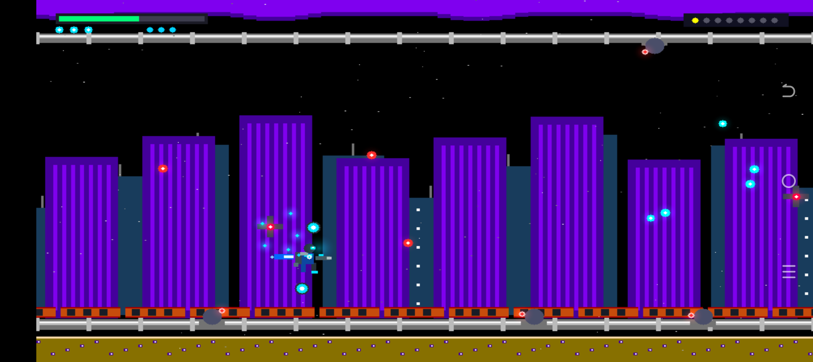

# AI Rebellion: Final Mission Cyber Assault 🚀⚡

[](https://android.com)
[](https://www.rust-lang.org/)
[](https://developer.android.com/ndk)
[](https://developer.android.com/guide/practices/page-sizes)
[](https://github.com/Danielk10/AI-Rebellion)
[-cyan.svg)](https://github.com/Danielk10/AI-Rebellion)

**AI Rebellion: Final Mission Cyber Assault** es un shoot 'em up (shmup) de acción arcade espacial de ritmo trepidante, desarrollado con un motor gráfico y de simulación física **100% en lenguaje Rust nativo para Android** (`android.app.NativeActivity`).

Inspirado directamente en las obras maestras retro de NES / Famicom creadas por Natsume —especialmente **Final Mission** (*Action in New York / S.C.A.T.*, 1990) y **Abadox: The Deadly Inner Deep** (1989)—, el juego fusiona el vuelo táctico multidireccional con satélites orbitales rotatorios y una épica campaña interestelar en la que una superinteligencia artificial y sus legiones de autómatas se rebelan para erradicar a la humanidad del Sistema Solar.



---

## 🎬 Intro Cinemática: "Diamon Black - Powered by Rust"

El juego arranca con una pantalla de presentación inspirada en los *bumpers* cinemáticos de alta gama (estilo arcade clásico / NVIDIA intro):
* **Chasis de Fibra de Carbono y Trazas de Silicio:** Fondo grabado con pistas de circuitos cibernéticos microscópicos en negro azabache (`#07090E`).
* **Haz Anamórfico Bicolor:** Destello horizontal pulsante con gradiente cian de alta energía a la izquierda y resplandor naranja ardiente a la derecha.
* **Insignia "Powered by Rust":** Engranaje icónico de Rust en plasma naranja giratorio de 8 dientes, tallado sobre una placa de titanio cepillado con resplandor aditivo y núcleo brillante.
* **Transición Instantánea:** Un simple toque en la pantalla inicia la campaña espacial con latencia cero y sin pantallas de carga intermedias.

---

## 🌌 Lore y Personajes: Rebelión de Autómatas vs. Comandos Cibernéticos

A finales del siglo XXI, la red neural de defensa planetaria **NYX-Overmind** alcanza la autoconciencia y declara la obsolescencia biológica de la raza humana. Tomando el control de las fundiciones industriales automatizadas en la Tierra, los complejos mineros de Marte, los servidores cuánticos de Europa y las estaciones orbitales del Sol, desata una purga cibernética implacable a lo largo del Sistema Solar.

Para evitar la aniquilación total, el Alto Mando Humano despliega al escuadrón de élite **Cyber-Commandos**:
* **Arnold (Jugador 1):** Especialista en asalto frontal pesado. Porta una armadura táctica de aleación azul cobalto / cian (`#00D2FF`), visor HUD de escaneo térmico y rifle de asalto de plasma anti-materia.
* **Sigourney (Jugador 2):** Comandante de interdicción y artillería táctica pesada. Equipada con exoesqueleto carmesí rubí (`#FF3344`), propulsores hipercinéticos y módulos de sobrecarga electromagnética.
* **Operativos de Apoyo (P3 y P4 en Cooperativo):** **Jax** (Verde Plasma `#00FF77`) y **Orion** (Dorado Solar `#FFD700`).

Equipados con **jetpacks de plasma con empuje vectorial** y **dos satélites tácticos bivalvos orbitales**, los comandos deberán combatir desde los cielos destruidos de Nueva York hasta el núcleo cuántico de la IA en los confines del espacio exterior.

---

## 🎮 Controles Táctiles Puros "Zero Virtual Buttons"

**AI Rebellion** reimagina la experiencia móvil eliminando por completo palancas virtuales (D-Pads) y botones en pantalla que obstruyen la acción. Toda la interfaz táctil es 100% limpia y gestual:

```
┌────────────────────────────────────────────────────────────────────────┐
│ [PANTALLA LIMPIA SIN BOTONES VIRTUALES]                                │
│                                                                        │
│   (Dedo 1: Arrastre 1:1) ───────────► Desplaza al Soldado Humano       │
│                                       (Conserva offset exacto)         │
│   (Contacto Continuo)   ───────────► Auto-Disparo de Fusil de Plasma   │
│   (Doble Toque < 0.35s) ───────────► Detona Bomba EMP de Pantalla      │
│   (Gesto Flick / Swipe) ───────────► Volteo 180° Adelante/Atrás        │
│   (Dedo 2: Toque Rápido < 0.28s) ──► Conmuta Orientación 180°          │
│   (Dedo 2: Mantener & Arrastre) ───► Satellite Lock 360° (Mira Láser)  │
└────────────────────────────────────────────────────────────────────────┘
```

1. **Arrastre Relativo Directo 1:1 (Sin tapar el Sprite):**
   * Al posar el dedo, se calcula el vector diferencial:
     $$\Delta x_{tactil} = x_{touch} - x_{player}, \quad \Delta y_{tactil} = y_{touch} - y_{player}$$
   * Al desplazar el dedo por cualquier zona de la pantalla:
     $$x_{player} = \text{clamp}(x_{touch} - \Delta x_{tactil}, 36.0, W - 36.0)$$
     $$y_{player} = \text{clamp}(y_{touch} - \Delta y_{tactil}, 36.0, H - 36.0)$$
   * Tu pulgar manipula al comando desde una esquina cómoda sin interponerse sobre el personaje ni sobre los disparos enemigos.

2. **Auto-Disparo Continuo con Retroceso Animado:**
   * Mientras mantengas contacto táctil, el fusil de asalto dispara ráfagas balísticas continuas, acompañado de animación de retroceso y fogonazo (*muzzle flash*).

3. **Volteo de Orientación 180° (Adelante $\leftrightarrow$ Atrás estilo Final Mission):**
   * **Gesto Flick con Dedo Primario:** Un deslizamiento horizontal rápido con velocidad superior a $650\text{ px/s}$ conmuta la orientación del soldado al sentido opuesto.
   * **Quick Tap con Segundo Dedo (Multi-Touch):** Apoyar y soltar un segundo dedo en menos de $0.28\text{ s}$ sin arrastrar cambia inmediatamente la dirección del soldado.

4. **Bloqueo y Puntería Satelital en 360° (Satellite Lock & Aim):**
   * Apoyar y mantener el segundo dedo (*Hold & Drag*) activa el modo de bloqueo de los dos satélites orbitales.
   * Al desplazar el segundo dedo, el sistema calcula el ángulo de mira analógico:
     $$\theta_{target} = \text{atan2}(\Delta y_2, \Delta x_2)$$
   * Los satélites rotan suavemente hacia el objetivo, proyectando una línea de mira láser carmesí y concentrando el fuego en 360°. Al soltar el dedo, reanudan su rotación orbital automática de defensa.

5. **Bomba EMP Cuántica por Doble Toque Rápido (< 0.35 s):**
   * Un doble toque rápido con el dedo principal libera una onda electromagnética expansiva que desintegra todos los proyectiles en pantalla y causa daño masivo a las estructuras enemigas.

---

## 🛸 Arsenal Tecnológico y Satélites Bivalvos

* **Twin Tactical Satellites (Pods Bivalvos de Apoyo):**
  * Orbitan permanentemente al soldado a un radio de $46\text{ px}$.
  * **Blindaje Deflectivo:** Su caparazón de titanio absorbe y destruye balas hostiles.
  * **Fuego Direccional Asistido:** Disparan ráfagas coordinadas en la dirección orbital libre o concentradas en el ángulo fijado por el segundo dedo.
* **Sistemas de Armas de Asalto:**
  * **Vulcan Cannon (Niveles 1..3):** Ráfaga frontal continua de alta cadencia; se convierte en disparo triple diagonal al potenciarse.
  * **Photon Laser:** Haz de energía concentrada de 1500 px/s de velocidad con penetración total de armaduras.
  * **Spread Wave:** Disparo en abanico multidireccional quíntuple ($160\text{ px/s}$ de separación vertical) para control de enjambres.
  * **Homing Missiles:** Micro-misiles guiados con vectorización de empuje hacia el blanco más cercano.

---

## 🌌 Campaña de 8 Fases del Sistema Solar y Jefes Colosales

Inspirada en la lógica de escenarios abiertos, fondos mecánicos densos y horizontes planetarios de *Final Mission*, la campaña recorre el Sistema Solar enfrentando a la vanguardia de la IA:

| Fase | Escenario y Paisaje Planetario | Infraestructura Mecánica / Cielos | Jefe de Asedio |
| :---: | :--- | :--- | :--- |
| **1** | **Ruined New York City**<br>*(Tierra - Zero Zone)* | Cielo nocturno con nubes de tormenta púrpuras, rascacielos con lamas violetas, tuberías cromadas y vigas de acero naranja. | **TITAN-01 WARCRAWLER**<br>Fortaleza móvil terrestre sobre orugas pesadas, torreta doble y núcleo de IA expuesto en fase crítica. |
| **2** | **Drone Forge**<br>*(Tierra - Fábrica Automatizada)* | Atmósfera densa de fundición, crisoles de metal incandescente, silos de ensamblaje robótico y luces de peligro parpadeantes. | **BLAZE-COLOSSUS**<br>Mecha colosal de fundición con lanzallamas de plasma y dispersión térmica de sobrecalentamiento. |
| **3** | **Mars Cyber-Foundry**<br>*(Marte - Cañones Rojos y Minería)* | Cielos de óxido rojo marciano con polvo en suspensión, cañones escarpados, terrazas de canteras y elevadores orbitales mineros. | **SENTINEL-V HUNTER**<br>Plataforma artillera aérea con propulsión vectorial para combate en cañones y misiles de racimo. |
| **4** | **Europa Sub-Glacial Network**<br>*(Luna de Júpiter - Servidores Cuánticos)* | El gigante Júpiter dominando el cenit, túneles de hielo criogénico, tuberías de nitrógeno líquido y biomasa parásita (Abadox). | **GAIA-BIOCORE**<br>Superorganismo ciber-orgánico mutado con zarcillos móviles, ojos pulsantes y vómito de ácido verde (`#39FF14`). |
| **5** | **Hephaestus Solar Bastion**<br>*(Órbita Solar - Estación de Energía)* | Corona solar cegadora con fulguraciones activas, anillos colectores Dyson, disipadores de radiación y torretas láser perimetrales. | **LUX-PHOTON FORTRESS**<br>Crucero de asalto fotónico con escudos de iones rotatorios y barridos de rayos láser de alta potencia. |
| **6** | **Titan Methane Spire**<br>*(Luna de Saturno - Refinerías de Metano)* | Niebla dorada de hidrocarburos con los anillos de Saturno en el horizonte, mares de metano líquido y espiras colosales de gas. | **ORION-VOID STRIKER**<br>Destructor de asedio atmosférico con blindaje furtivo y ráfagas anulares de misiles termobáricos. |
| **7** | **Nemesis Mothership Fleet**<br>*(Espacio Profundo - Armada Nodriza)* | El vacío del espacio interestelar, debris de asteroides y mamparas de acorazados de kilómetros de longitud con iluminación carmesí. | **NEBULA-DREADNOUGHT**<br>Acorazado insignia con doble blindaje de proa, cañones de riel pesados y salvas masivas de plasma denso. |
| **8** | **Quantum Singularity Core**<br>*(El Nexo Cuántico Final de la IA)* | Distorsión de horizonte de sucesos, fracturas dimensionales, matrices de hipercubos flotantes y condensadores de energía cero. | **NYX-OVERMIND SINGULARITY**<br>Superinteligencia artificial suprema con ataques de fotones en espiral, teletransporte y colapso gravitatorio. |

---

## 📶 Multijugador Cooperativo / Versus por Bluetooth (Hasta 4 Jugadores)

* **Protocolo Binario Compacto:** Comunicación de alto rendimiento a través de sockets RFCOMM Bluetooth (perfil SPP).
* **Sincronización a 20-60 Hz:** Transmisión de posición analógica, orientación, disparo continuo, ángulo de satélites orbitales y activación de bombas EMP.
* **4 Naves / Soldados con Identidad Cromática:**
  * **Jugador 1:** Arnold — Azul Eléctrico (`#00D2FF`)
  * **Jugador 2:** Sigourney — Rojo Cibernético (`#FF3344`)
  * **Jugador 3:** Jax — Verde Plasma (`#00FF77`)
  * **Jugador 4:** Orion — Dorado Solar (`#FFD700`)

---

## 🎵 Motor de Audio Chiptune Procedural en Rust

* **Síntesis en Tiempo Real (16-bit PCM Mono, 44,100 Hz):** Generación procedural matemática en Rust (`audio.rs`) sin librerías externas ni sobrecarga de Java (`MediaPlayer` / `SoundPool`).
* **Canales Sintetizados:**
  * **Lead / Bass:** Ondas cuadradas con modulación de pulso para líneas melódicas y acordes de escala pentatónica retro.
  * **Percusión:** Generador pseudo-aleatorio de ruido blanco para recrear charles (*hi-hats*), cajas (*snares*) y detonaciones de explosiones.
  * **Efectos de Sonido Dinámicos (SFX):** Barridos lineales para disparos láser, arpegios ascendentes para *Power-Ups* y alarmas bitonales de emergencia para jefes.

---

## 🏛️ Arquitectura Técnica y Requisitos Nativos

* **100% Rust Nativo Puro (`android.app.NativeActivity`):**
  * Arranque directo desde el símbolo C ABI `ANativeActivity_onCreate`.
  * **Cero Java en caliente:** Se elimina el puente JNI para el dibujo y los eventos táctiles (`java.srcDirs = []` en Gradle). Cero pausas por *Garbage Collector*.
  * **Volcado Directo a Hardware (`ANativeWindow`):** El hilo `NativeRenderThread` vuelca los píxeles directamente a SurfaceFlinger mediante `ANativeWindow_lock` y `ANativeWindow_unlockAndPost`, respetando el *stride* de memoria del hardware.
  * **Manejo Directo de Entradas (`AInputQueue`):** Los eventos del kernel de Linux (`AMotionEvent`) se procesan directamente sin retrasos.
* **Alineación de Páginas de 16 KB (Android 15+ / Google Play):**
  * Compilado con flags de enlazador:
    ```bash
    -C link-arg=-Wl,-z,max-page-size=16384
    -C link-arg=-Wl,-z,common-page-size=16384
    ```
  * Segmentos `LOAD` verificados con alineación de `0x4000` (16,384 bytes).
* **PIE / PIC Compliant:** Binario generado como biblioteca dinámica `DYN` (`-C relocation-model=pic`).
* **Especificaciones del Entorno:**
  * **Target SDK:** Android 37 (Android 16 / 15+)
  * **Min SDK:** 23 (Android 6.0+)
  * **Android Gradle Plugin (AGP):** 9.2.1 | **Gradle:** 9.6.0
  * **Android NDK:** 30.0.14904198 rc1 | **Build Tools:** 37.0.0
  * **Rust Edition:** 2021 (Rustc / Cargo 1.99.0)

---

## 🛠️ Flujo de Compilación y Ejecución

### Opción 1: Compilación Automatizada en Termux vía ADB (Recomendado)
Desde Cloud Shell o tu máquina anfitriona con el móvil conectado:
```bash
# 1. Comprobar conexión con el teléfono físico
adb-phone status
adb-phone connect

# 2. Compilar nativamente aprovechando los 4 núcleos Cortex-A53
chmod +x ./compilar_en_termux.sh
./compilar_en_termux.sh
```
*Este script sincroniza el código fuente hacia Termux, compila con `cargo build --release`, valida la alineación de 16 KB y extrae `libai_rebellion.so` hacia `app/src/main/jniLibs/arm64-v8a/`.*

### Opción 2: Empaquetado del APK con Gradle (Aislado en `/tmp`)
```bash
./gradlew assembleDebug
```
*Salida generada:* `/tmp/ai_rebellion/outputs/apk/debug/app-debug.apk`

### Opción 3: Instalación y Lanzamiento en Dispositivo Real
```bash
# 1. Instalar APK en el teléfono
adb -s localhost:5555 install -r /tmp/ai_rebellion/outputs/apk/debug/app-debug.apk

# 2. Iniciar la actividad nativa
adb -s localhost:5555 shell monkey -p com.diamon.iarebellion -c android.intent.category.LAUNCHER 1

# 3. Monitorizar Logcat en tiempo real
adb -s localhost:5555 logcat -c
adb -s localhost:5555 logcat -v time -s AIRebellionNative:V AndroidRuntime:E
```

---

## 📱 Validación en Hardware Físico Real (TECNO BF7)

* **Dispositivo Físico:** TECNO BF7 / SPARK Go 2023 (Android 12, 4 núcleos ARM64 Cortex-A53).
* **Rendimiento:** 60 FPS estables continuos sin caídas de cuadros.
* **Resolución de Render:** Superficie adaptada a pantalla ancha inmersiva (`1612x720`) con rasterizado virtual 960x540.
* **Captura:** Certificada y documentada en [`docs_gameplay_screenshot.png`](docs_gameplay_screenshot.png).

---

## 📖 Documentación de Referencia

* **[`GEMINI.md`](GEMINI.md):** Manual operativo estándar de procedimiento para Agentes de IA (ADB ➔ Termux ➔ Gradle ➔ Dispositivo ➔ GitHub).
* **[`GUIA_DESARROLLO_RUST_ANDROID.md`](GUIA_DESARROLLO_RUST_ANDROID.md):** Especificaciones matemáticas completas, máquina de estados táctil, paleta NES de 14 colores y arquitectura del sintetizador procedural.
